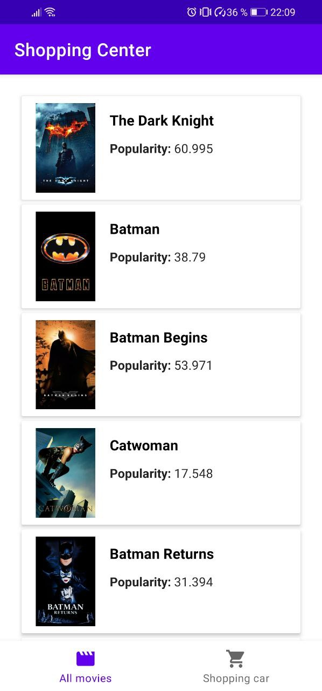
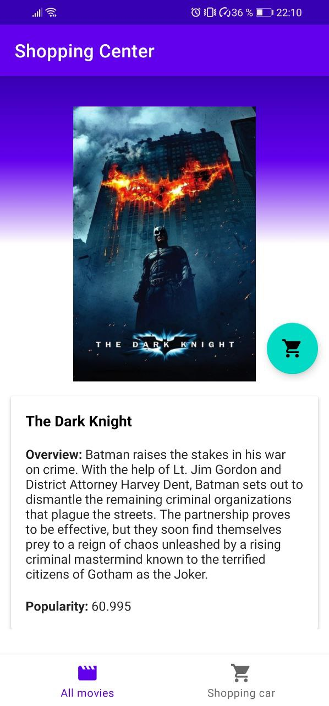
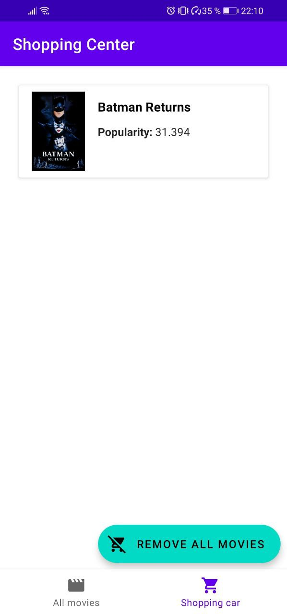

**Shopping Center**

Aplicacion para visualizar peliculas, la descripcion de la pelicula y poder agregar elementos a un carrito de compra.

---

## Funcionamiento del deep link

El direccionamiento a la pantalla de detalle de la pelicula.

1. Los elementos de Movie son agregados y el RecyclerView desplega un listado de las peliculas.
2. En el MovieAdapter se encuentra el adaptador que personaliza cada elemento y cada accion.
3. Dentro el MovieADapter se encuentra un when que permite generar una validacion para poder personalizar la accion de AllMovies o ShoppingCart.
4. Se crean dos ViewHolder para las acciones de AllMovies en este se pueden ver tres acciones: agregar pelicula, eliminar pelicula y ver detalle pelicula,
	para ShoppingCart solo se pueden visualizar dos acciones: eliminar pelicula y ver detalle pelicula.
5. La accion de agregar pelicula, agrega el id de la pelicula en la tabla shoppingcart para despues poderlo traer por medio de un Query de la tabla
	donde se encuentran todas las peliculas en la base de datos local.
6. La accion de Eliminar pelicula, elimina el id de la pelicula que se encuentra en la tabla shoppingcart en la base de datos local.
7. La accion de ver detalle de la pelicula, direcciona al fragmento AboutOfMovie para ver mas a detalle la pelicula.

---

## Descripción arquitectura

Para el desarrollo de esta aplicacion se hizo uso del patron DDD para poder separar la logica del negocio, la infraestructura y la parte visual, tambien haciendo uso de MVVM para la capa de application.

1. application: Se encuentra todo el desarrolo para mostrar la informacion y que el usuario pueda interactuar con el software.
2. domain: Se encuentra la logica del negocio, y separa la responsabilidad de la parte visual y de persistencia, se comunica mediante interfaces.
3. infraestructure: Se encuentra la parte de network y base de datos locas, para poder traer la informacion y tambien para poder persistirla.

---

## Imagenes de la aplicación 

1. Lista de peliculas.

2. Detalle de la pelicula.

3. El carrito.

